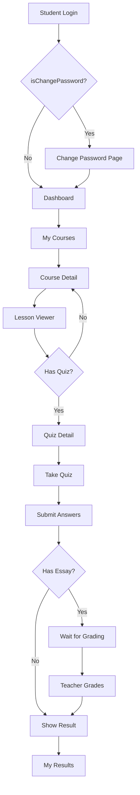

# 👨‍🎓 Student Portal - E-Learning MJK

## ภาพรวม
Student Portal เป็นส่วนหน้าบ้านสำหรับนักเรียน ให้นักเรียนสามารถเข้าถึงเนื้อหาบทเรียน ทำแบบทดสอบ และดูผลคะแนนได้

---

## 🎨 UI/UX Design

### Theme & Colors
- **สีหลัก:** น้ำเงิน (Blue) - ชมพู (Pink) Gradient
- **รองรับ Dark Mode:** ✅ (Toggle ที่ Navbar)
- **Responsive:** Mobile, Tablet, Desktop

### Layout Structure
```
┌─────────────────────────────────────────────────────────┐
│  Navbar: Logo | Menu (Center) | Student Info + Theme   │
├─────────────────────────────────────────────────────────┤
│                                                         │
│  Quick Actions (3 Cards)                                │
│  ┌─────────┐  ┌─────────┐  ┌─────────┐                │
│  │ Courses │  │ Quizzes │  │ Results │                │
│  └─────────┘  └─────────┘  └─────────┘                │
│                                                         │
│  📚 My Courses (Grid - 4 columns)                       │
│  ┌─────┐  ┌─────┐  ┌─────┐  ┌─────┐                   │
│  │Card │  │Card │  │Card │  │Card │                   │
│  └─────┘  └─────┘  └─────┘  └─────┘                   │
│                                                         │
│  📝 Upcoming Quizzes (List)                             │
│  ┌─────────────────────────────────────────┐           │
│  │ Quiz 1 | Due: 15 Nov | เริ่มทำ         │           │
│  └─────────────────────────────────────────┘           │
│                                                         │
│  🏆 Recent Results (List)                               │
│  ┌─────────────────────────────────────────┐           │
│  │ Math Quiz 1 | 85% | ผ่าน ✓              │           │
│  └─────────────────────────────────────────┘           │
│                                                         │
└─────────────────────────────────────────────────────────┘
```

---

## 📁 ไฟล์ที่สร้างแล้ว

### Layouts
- [layouts/student.vue](layouts/student.vue) - Student layout with navbar

### Pages
- [pages/student/login.vue](pages/student/login.vue) - Student login page
- [pages/student/dashboard.vue](pages/student/dashboard.vue) - Student dashboard (landing page)

### Components
- [components/student/CourseCard.vue](components/student/CourseCard.vue) - Course card component
- [components/student/QuizListItem.vue](components/student/QuizListItem.vue) - Quiz list item
- [components/student/ResultListItem.vue](components/student/ResultListItem.vue) - Result list item
- [components/student/QuickActions.vue](components/student/QuickActions.vue) - Quick action cards

---

## 🚀 Features ที่ทำเสร็จแล้ว

### ✅ Student Login Page
- รองรับการ login ด้วย studentId + password
- แสดง/ซ่อน password
- Validation form
- Error handling
- Responsive design

**Demo Credentials:**
- รหัสนักเรียน: `STD001`
- รหัสผ่าน: `student123`

### ✅ Student Navbar
- **ซ้ายสุด:** ชื่อระบบ (E-Learning MJK) พร้อม gradient
- **ตรงกลาง:** เมนูหลัก
  - วิชาของฉัน (My Courses)
  - แบบทดสอบ (Quizzes)
  - ผลคะแนน (Results)
- **ขวาสุด:**
  - Dark Mode Toggle (Sun/Moon icon)
  - ชื่อ + รหัสนักเรียน + Avatar
  - ปุ่ม Logout
- **Mobile Menu:** Hamburger menu สำหรับ mobile

### ✅ Dashboard Sections

#### 1. Quick Actions
- 3 การ์ดแนวนอน (Courses, Quizzes, Results)
- Gradient background (Blue, Pink, Purple)
- Hover scale effect
- Link ไปหน้าต่างๆ

#### 2. My Courses
- แสดงเป็น Grid (1, 2, 3, 4 columns ตาม screen size)
- แต่ละการ์ดมี:
  - Gradient background (สุ่มตาม course code)
  - ชื่อวิชา + รหัสวิชา
  - ชื่อครูผู้สอน
  - ปีการศึกษา + ภาคเรียน
  - Progress bar
  - ปุ่ม "เข้าเรียน"
- Hover effects
- Empty state (ถ้าไม่มีวิชา)
- Loading skeleton

#### 3. Upcoming Quizzes
- แสดงเป็น List (แนวนอน)
- แต่ละรายการมี:
  - ไอคอนสถานะ (สี: primary, warning, disabled)
  - ชื่อแบบทดสอบ
  - ชื่อวิชา
  - กำหนดส่ง (deadline)
  - จำนวนครั้งที่ทำได้/ทำไปแล้ว
  - เวลาที่ใช้ (ถ้ามี)
  - ปุ่ม "เริ่มทำ" / "ทำอีกครั้ง" / "ทำครบแล้ว"
  - แจ้งเตือนใกล้ deadline (ภายใน 3 วัน)
- Empty state
- Loading skeleton

#### 4. Recent Results
- แสดงเป็น List
- แต่ละรายการมี:
  - ไอคอนสถานะ (ผ่าน ✓, ไม่ผ่าน ✗, รอตรวจ ⏱)
  - ชื่อแบบทดสอบ + วิชา
  - วันที่ส่ง
  - คะแนน (score/maxScore)
  - เปอร์เซ็นต์ (%)
  - สถานะ (ผ่าน/ไม่ผ่าน/รอตรวจ)
  - ครั้งที่ทำ
  - Feedback จากครู (ถ้ามี)
  - ปุ่ม "ดูรายละเอียด"
- Color coding:
  - 🟢 Green: ผ่าน (Success)
  - 🔴 Red: ไม่ผ่าน (Error)
  - 🔵 Blue: รอตรวจ (Info)
- Empty state
- Loading skeleton

---

## 🎯 Component Props & Features

### CourseCard.vue
```typescript
Props {
  course: {
    id: string
    name: string
    code: string
    teacher?: { name: string }
    academicYear: string
    semester: number
  }
  progress?: number  // 0-100
}

Features:
- Auto-generate gradient based on course code
- Progress bar
- Click to navigate to course detail
- Hover animation
```

### QuizListItem.vue
```typescript
Props {
  quiz: {
    id: string
    title: string
    course?: { name: string }
    maxAttempts: number
    duration?: number
    availableFrom?: string
    availableUntil?: string
    attemptCount?: number
  }
}

Features:
- Calculate attempts left
- Check if can take quiz
- Show deadline warning (3 days)
- Status color coding
- Click to navigate to quiz detail
```

### ResultListItem.vue
```typescript
Props {
  result: {
    id: string
    quiz?: {
      title: string
      course?: { name: string }
      passingScore?: number
    }
    score: number
    maxScore: number
    percentage: number
    isPassed?: boolean
    isGraded: boolean
    submittedAt: string
    attemptNumber?: number
    feedback?: string
  }
}

Features:
- Auto-calculate isPassed (if not provided)
- Show different icons based on status
- Display feedback from teacher
- Show "waiting for grading" alert
- Click to navigate to result detail
```

---

## 🌐 Routes

```
/student/login           - Student login page
/student/dashboard       - Student dashboard (landing page)
/student/courses         - All courses (TODO)
/student/courses/:id     - Course detail (TODO)
/student/lessons/:id     - Lesson viewer (TODO)
/student/quizzes         - All quizzes (TODO)
/student/quizzes/:id     - Quiz detail (TODO)
/student/quizzes/:id/take - Take quiz (TODO)
/student/results         - All results (TODO)
/student/results/:id     - Result detail (TODO)
/student/profile         - Student profile (TODO)
```

---

## 📱 Responsive Breakpoints

```css
Mobile:   < 768px   (1 column)
Tablet:   768-1024px (2 columns)
Desktop:  1024-1280px (3 columns)
Large:    > 1280px   (4 columns)
```

### Course Cards Grid:
- Mobile: 1 column
- Tablet: 2 columns
- Desktop: 3 columns
- Large Desktop: 4 columns

---

## 🎨 Color Palette

### Gradients Used:
```css
/* Course Card Gradients (8 variants) */
gradient-1: linear-gradient(135deg, #667eea 0%, #764ba2 100%)
gradient-2: linear-gradient(135deg, #f093fb 0%, #f5576c 100%)
gradient-3: linear-gradient(135deg, #4facfe 0%, #00f2fe 100%)
gradient-4: linear-gradient(135deg, #43e97b 0%, #38f9d7 100%)
gradient-5: linear-gradient(135deg, #fa709a 0%, #fee140 100%)
gradient-6: linear-gradient(135deg, #30cfd0 0%, #330867 100%)
gradient-7: linear-gradient(135deg, #a8edea 0%, #fed6e3 100%)
gradient-8: linear-gradient(135deg, #ff9a9e 0%, #fecfef 100%)

/* Primary Gradient (Blue-Pink) */
from-blue-600 to-pink-600

/* Quick Actions */
Blue:   from-blue-500 to-blue-600
Pink:   from-pink-500 to-pink-600
Purple: from-purple-500 to-purple-600
```

---

## 🔧 ขั้นตอนการทดสอบ

### 1. รัน Development Server
```bash
yarn dev
```

### 2. เปิดหน้า Login
```
http://localhost:3000/student/login
```

### 3. Login ด้วย Demo Credentials
- รหัสนักเรียน: `STD001`
- รหัสผ่าน: `student123`

### 4. ทดสอบ Features
- ✅ Dashboard แสดงข้อมูล Mock
- ✅ Dark Mode Toggle
- ✅ Responsive (ลองเปลี่ยน screen size)
- ✅ Hover effects
- ✅ Click navigation (จะ error เพราะยังไม่มีหน้าปลายทาง)

---

## 📝 TODO: หน้าที่ต้องพัฒนาต่อ

### Phase 1: Core Pages (ลำดับความสำคัญสูง)
- [ ] `/student/courses` - All courses page
- [ ] `/student/courses/:id` - Course detail + lesson list
- [ ] `/student/lessons/:id` - Lesson viewer (read content)
- [ ] `/student/quizzes/:id` - Quiz detail + start quiz
- [ ] `/student/quizzes/:id/take` - Take quiz page

### Phase 2: Results & Profile
- [ ] `/student/results` - All results page
- [ ] `/student/results/:id` - Result detail page
- [ ] `/student/profile` - Student profile page
- [ ] `/student/change-password` - Change password (first login)

### Phase 3: API Integration
- [ ] Connect to Student Auth API
- [ ] Connect to Courses API (filter by student's room)
- [ ] Connect to Quizzes API
- [ ] Connect to Quiz Attempts API
- [ ] Connect to Lesson Progress API

### Phase 4: Advanced Features
- [ ] Notification system
- [ ] Search functionality
- [ ] Course filtering/sorting
- [ ] Progress tracking
- [ ] Certificate/Achievement system

---

## 🎓 Data Flow



---

## 🚨 Important Notes

### Mock Data
ปัจจุบันใช้ Mock Data ทั้งหมด ต้องเชื่อมกับ API จริงในอนาคต:
- Student info (ชื่อ, รหัส, รูปโปรไฟล์)
- Courses list
- Quizzes list
- Results list

### Authentication
- ยังไม่มี JWT/Session management
- ยังไม่มี Protected routes
- ต้องเพิ่ม Middleware สำหรับ authentication

### Validation
- Form validation ทำเบื้องต้นแล้ว
- ต้องเพิ่ม validation ฝั่ง server

---

## 📚 Dependencies ที่ใช้

```json
{
  "@heroicons/vue": "^2.2.0",      // Icons
  "daisyui": "^5.1.6",              // UI Components
  "tailwindcss": "^3.4.17",         // CSS Framework
  "nuxt": "^4.1.0",                 // Framework
  "vue": "^3.x"                     // Vue 3
}
```

---

## 🎉 เสร็จสิ้น!

Student Dashboard UI พร้อมใช้งานแล้ว!

พร้อมพัฒนาหน้าอื่นๆ ต่อไปได้เลยครับ 🚀
