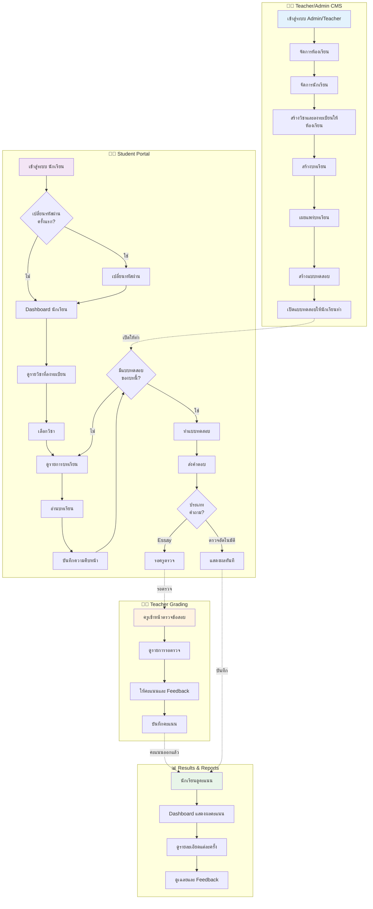
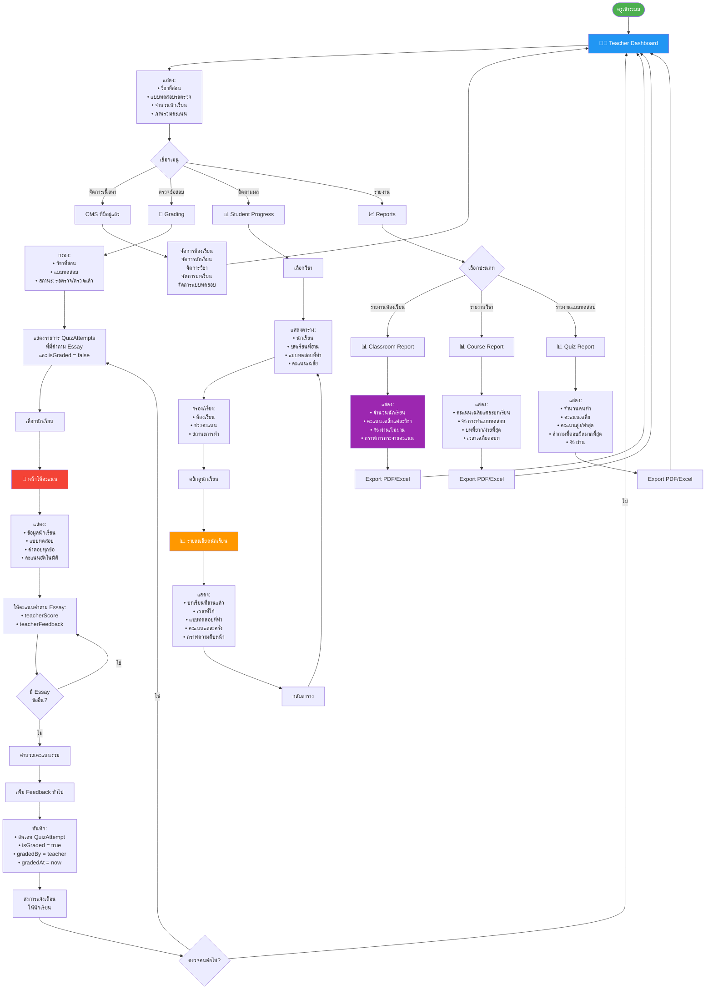
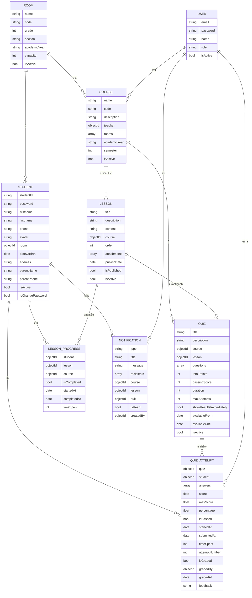

# 📊 E-Learning Platform - Flow Diagrams

## ภาพรวม
เอกสารนี้อธิบาย Flow การทำงานของระบบ E-Learning สำหรับนักเรียนและครู รวมถึงความสัมพันธ์ของข้อมูลในระบบ

---

## 1. ภาพรวมระบบทั้งหมด (Overall System Flow)



---

## 2. Flow นักเรียน - รายละเอียด (Student Detailed Flow)

```mermaid
flowchart TD
    Start([นักเรียนเข้าระบบ]) --> Login[Login ด้วย studentId + password]
    Login --> CheckFirstLogin{isChangePassword<br/>= true?}

    CheckFirstLogin -->|ใช่| ChangePass[หน้าเปลี่ยนรหัสผ่าน]
    ChangePass --> UpdatePass[อัพเดทรหัสผ่าน<br/>isChangePassword = false]
    UpdatePass --> Dashboard

    CheckFirstLogin -->|ไม่| Dashboard[📊 Dashboard]

    Dashboard --> ShowInfo[แสดง:<br/>• วิชาที่ลงทะเบียน<br/>• แบบทดสอบที่ต้องทำ<br/>• ความคืบหน้า<br/>• คะแนนล่าสุด]

    ShowInfo --> Menu{เลือกเมนู}

    Menu -->|วิชาของฉัน| Courses[📚 My Courses]
    Menu -->|แบบทดสอบ| Quizzes[📝 My Quizzes]
    Menu -->|ผลคะแนน| Results[📊 My Results]
    Menu -->|โปรไฟล์| Profile[👤 Profile]

    %% Courses Flow
    Courses --> CourseList[แสดงรายวิชา<br/>filter by: room ของนักเรียน<br/>และ isActive = true]
    CourseList --> SelectCourse[เลือกวิชา]
    SelectCourse --> LessonList[แสดงรายการบทเรียน<br/>isPublished = true<br/>เรียงตาม order]

    LessonList --> SelectLesson[เลือกบทเรียน]
    SelectLesson --> ViewLesson[📖 อ่านบทเรียน]
    ViewLesson --> ReadContent[แสดง:<br/>• เนื้อหา HTML<br/>• ไฟล์แนบ<br/>• วิดีโอ]

    ReadContent --> TrackProgress[บันทึก LessonProgress:<br/>• startedAt<br/>• timeSpent<br/>• isCompleted]

    TrackProgress --> CheckQuiz{มีแบบทดสอบ<br/>ของบทนี้?}
    CheckQuiz -->|ใช่| ShowQuizButton[แสดงปุ่ม<br/>'ทำแบบทดสอบ']
    CheckQuiz -->|ไม่| BackToLessonList[กลับรายการบทเรียน]

    ShowQuizButton -->|คลิก| Quizzes
    BackToLessonList --> LessonList

    %% Quizzes Flow
    Quizzes --> QuizList[แสดงรายการแบบทดสอบ<br/>filter by:<br/>• วิชาที่ลงทะเบียน<br/>• availableFrom <= now<br/>• availableUntil >= now<br/>• isActive = true]

    QuizList --> SelectQuiz[เลือกแบบทดสอบ]
    SelectQuiz --> QuizDetail[แสดงรายละเอียด:<br/>• จำนวนคำถาม<br/>• เวลาที่ใช้<br/>• ทำไปแล้วกี่ครั้ง<br/>• คะแนนที่ดีที่สุด]

    QuizDetail --> CheckAttempts{ครั้งที่ทำ <<br/>maxAttempts?}
    CheckAttempts -->|ไม่| CanTake[แสดงปุ่ม 'เริ่มทำ']
    CheckAttempts -->|ใช่| CannotTake[แสดง 'ทำครบแล้ว']

    CanTake -->|คลิก| StartQuiz[สร้าง QuizAttempt:<br/>• startedAt = now<br/>• attemptNumber++]

    StartQuiz --> TakeQuiz[📝 หน้าทำแบบทดสอบ]
    TakeQuiz --> ShowQuestions[แสดงคำถาม:<br/>• Multiple Choice<br/>• True/False<br/>• Checkboxes<br/>• Short Answer<br/>• Essay]

    ShowQuestions --> Timer{มี duration?}
    Timer -->|ใช่| ShowTimer[แสดง Timer นับถอยหลัง]
    Timer -->|ไม่| NoTimer[ไม่มี Timer]

    ShowTimer --> AnswerQ[นักเรียนตอบคำถาม]
    NoTimer --> AnswerQ

    AnswerQ --> Submit[กดส่งคำตอบ]
    Submit --> ConfirmSubmit{ยืนยันส่ง?}

    ConfirmSubmit -->|ใช่| SaveAnswers[บันทึก QuizAttempt:<br/>• answers array<br/>• submittedAt = now<br/>• timeSpent]
    ConfirmSubmit -->|ไม่| AnswerQ

    SaveAnswers --> AutoGrade[ตรวจอัตโนมัติ:<br/>Multiple Choice,<br/>True/False, Checkboxes]

    AutoGrade --> CheckEssay{มีคำถาม<br/>Essay?}
    CheckEssay -->|ใช่| WaitGrade[รอครูตรวจ<br/>isGraded = false]
    CheckEssay -->|ไม่| FullGrade[คำนวณคะแนนเต็ม<br/>isGraded = true]

    FullGrade --> CheckShowResult{showResultsImmediately<br/>= true?}
    CheckShowResult -->|ใช่| ShowResult[แสดงผลทันที]
    CheckShowResult -->|ไม่| HideResult[ซ่อนผล]

    ShowResult --> Results
    HideResult --> Dashboard
    WaitGrade --> Dashboard

    %% Results Flow
    Results --> ResultList[แสดงรายการผลคะแนน:<br/>• แยกตามวิชา<br/>• แยกตามแบบทดสอบ<br/>• ประวัติทุกครั้งที่ทำ]

    ResultList --> SelectResult[เลือกดูรายละเอียด]
    SelectResult --> ResultDetail[แสดง:<br/>• คะแนนที่ได้<br/>• เปอร์เซ็นต์<br/>• ผ่าน/ไม่ผ่าน<br/>• เฉลยคำตอบ<br/>• Feedback ครู]

    ResultDetail --> BackToDashboard[กลับ Dashboard]
    BackToDashboard --> Dashboard

    %% Profile Flow
    Profile --> ShowProfile[แสดงข้อมูล:<br/>• ชื่อ-นามสกุล<br/>• รหัสนักเรียน<br/>• ห้องเรียน<br/>• รูปโปรไฟล์]
    ShowProfile --> ProfileMenu{เลือกแก้ไข}
    ProfileMenu -->|เปลี่ยนรหัสผ่าน| ChangePassword[เปลี่ยนรหัสผ่าน]
    ProfileMenu -->|อัพโหลดรูป| UploadAvatar[อัพโหลดรูปโปรไฟล์]
    ProfileMenu -->|กลับ| Dashboard

    ChangePassword --> Dashboard
    UploadAvatar --> Dashboard
    CannotTake --> QuizList

    style Start fill:#4caf50,color:#fff
    style Dashboard fill:#2196f3,color:#fff
    style ViewLesson fill:#ff9800,color:#fff
    style TakeQuiz fill:#f44336,color:#fff
    style ShowResult fill:#9c27b0,color:#fff
```



---

## 3. Flow ครู - การตรวจข้อสอบ (Teacher Grading Flow)



---

## 4. ความสัมพันธ์ข้อมูล (Data Relationship)



---

## 5. สรุป Use Cases

### 👨‍🎓 Use Cases สำหรับนักเรียน (Student Portal)

1. **Login & Authentication**
   - ล็อกอินด้วย `studentId` + `password`
   - เปลี่ยนรหัสผ่านครั้งแรก (ถ้า `isChangePassword = true`)
   - ดูโปรไฟล์ส่วนตัว

2. **Dashboard หลัก**
   - เห็นภาพรวมวิชาที่กำลังเรียน
   - เห็นแบบทดสอบที่กำลังเปิดให้ทำ/ยังไม่ได้ทำ
   - เห็นความคืบหน้าการเรียน (Progress)
   - การแจ้งเตือน (บทเรียนใหม่, แบบทดสอบใหม่, ผลคะแนนออกแล้ว)

3. **เรียกดูวิชา (My Courses)**
   - เห็นรายการวิชาที่ห้องตนลงเรียน
   - กรองตามภาคเรียน/ปีการศึกษา
   - เห็นครูผู้สอน, รายละเอียดวิชา

4. **เรียกดูบทเรียน (Lessons)**
   - คลิกเข้าวิชา → เห็นรายการบทเรียนที่เผยแพร่แล้ว
   - เรียงลำดับตาม `order`
   - อ่านเนื้อหา (HTML rich text)
   - ดาวน์โหลดไฟล์แนบ (attachments)
   - บันทึกความคืบหน้าการอ่าน (Mark as completed)

5. **ทำแบบทดสอบ (Quizzes)**
   - เห็นแบบทดสอบที่เปิดให้ทำ
   - ดูจำนวนครั้งที่ทำแล้ว vs maxAttempts
   - เริ่มทำแบบทดสอบ (Start Quiz)
   - ตอบคำถามหลายรูปแบบ
   - นับเวลาถอยหลัง (ถ้ามี duration)
   - ส่งแบบทดสอบ (Submit)
   - ดูผลคะแนน (ถ้า showResultsImmediately = true)

6. **ดูผลการเรียน (My Results)**
   - เห็นผลคะแนนทุกแบบทดสอบที่ทำ
   - เห็นคะแนนแต่ละครั้ง (Attempt History)
   - เห็นเฉลยคำตอบ
   - ดูความคิดเห็นจากครู (feedback)

---

### 👨‍🏫 Use Cases สำหรับครู (Teacher Portal)

1. **Login & Dashboard**
   - ล็อกอินด้วย User (ครู)
   - เห็น Dashboard วิชาที่สอน

2. **จัดการเนื้อหา (CMS - ที่มีอยู่แล้ว)**
   - จัดการห้องเรียน (Rooms)
   - จัดการนักเรียน (Students)
   - จัดการวิชา (Courses)
   - จัดการบทเรียน (Lessons) - สร้าง, แก้ไข, เผยแพร่
   - จัดการแบบทดสอบ (Quizzes)

3. **ติดตามและประเมินผล (NEW)**
   - ดูความคืบหน้าการเรียนของนักเรียน
   - ตรวจแบบทดสอบ (Essay questions)
   - ให้ feedback แต่ละข้อ
   - ดูรายงานผล (ห้องเรียน, วิชา, นักเรียน)
   - ส่งการแจ้งเตือน

---

## 6. หน้าจอที่ต้องพัฒนา

### สำหรับนักเรียน (Student Portal)

```
1. /student/login                    - หน้า Login สำหรับนักเรียน
2. /student/change-password          - เปลี่ยนรหัสผ่านครั้งแรก
3. /student/dashboard                - Dashboard หลัก
4. /student/courses                  - รายการวิชาที่เรียน
5. /student/courses/[courseId]       - รายละเอียดวิชา + บทเรียนทั้งหมด
6. /student/lessons/[lessonId]       - อ่านบทเรียน + ไฟล์แนบ
7. /student/quizzes                  - รายการแบบทดสอบทั้งหมด
8. /student/quizzes/[quizId]         - รายละเอียดแบบทดสอบ + เริ่มทำ
9. /student/quizzes/[quizId]/take    - หน้าทำแบบทดสอบ
10. /student/results                  - ผลการเรียนของตนเอง
11. /student/results/[attemptId]      - ดูผลแบบทดสอบแต่ละครั้ง
12. /student/profile                  - โปรไฟล์ส่วนตัว
```

### สำหรับครู (Teacher Portal)

```
ใช้ CMS ที่มีอยู่ + เพิ่มหน้าใหม่:

1. /admin/teacher/dashboard          - Dashboard สำหรับครู
2. /admin/teacher/courses            - วิชาที่สอน
3. /admin/teacher/progress/[courseId] - ติดตามความคืบหน้านักเรียน
4. /admin/teacher/grading            - รายการแบบทดสอบรอตรวจ
5. /admin/teacher/grading/[attemptId] - ให้คะแนนและ feedback
6. /admin/teacher/reports/classroom   - รายงานผลห้องเรียน
7. /admin/teacher/reports/course      - รายงานผลวิชา
8. /admin/teacher/reports/student/[studentId] - รายงานผลนักเรียน
9. /admin/teacher/notifications       - ส่งการแจ้งเตือน
```

---

## 7. Data Models ใหม่ที่ต้องเพิ่ม

### LessonProgress (ติดตามความคืบหน้าการอ่านบทเรียน)
```typescript
{
  _id: ObjectId
  student: ref -> Student
  lesson: ref -> Lesson
  course: ref -> Course
  isCompleted: boolean
  startedAt: Date
  completedAt?: Date
  timeSpent: number              // วินาที
  createdAt: Date
  updatedAt: Date
}
```

### Notification (การแจ้งเตือน)
```typescript
{
  _id: ObjectId
  type: 'NEW_LESSON' | 'NEW_QUIZ' | 'QUIZ_RESULT' | 'ANNOUNCEMENT'
  title: string
  message: string
  recipients: [ref -> Student]
  course?: ref -> Course
  lesson?: ref -> Lesson
  quiz?: ref -> Quiz
  isRead: boolean
  createdBy: ref -> User
  createdAt: Date
}
```
